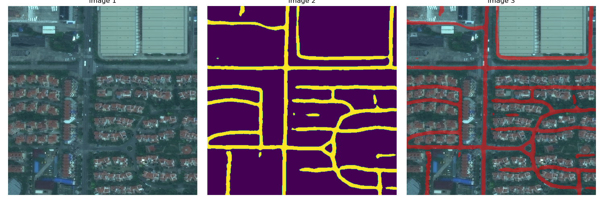

# Road Network Detection

This project focuses on detecting road networks from aerial and satellite images. It includes preprocessing, training, and prediction steps to extract road networks effectively.

## Dataset
The dataset used for training is available on AWS and can be accessed without login:
```
aws s3 ls --no-sign-request s3://spacenet-dataset/
```

## Features
- **Image Preprocessing:** Converts and augments images.
- **Model Training:** Trains a deep learning model for road segmentation.
- **Prediction:** Predicts road networks on new images.
- **Results Visualization:** Provides output images highlighting detected roads.

## Project Structure
```
road network detection/
│── image preprocessing/
│   ├── cnv_imgs/
│   │   ├── apl_tools.py  # Image conversion utilities
│   │   ├── cnv_img.ipynb # Image conversion notebook
│   ├── img_augmentation/
│   │   ├── aug.py  # Data augmentation script
│
│── training/
│   ├── train.ipynb  # Model training notebook
│   ├── split_data/
│   │   ├── spliting.py  # Data splitting script
│
│── prediction/
│   ├── prediction.py  # Road network prediction script
│
│── results/
│   ├── results.png  # Example output
```

## Installation & Setup
1. Clone this repository:
   ```bash
   git clone https://github.com/Harshilsangani/road-network-detection.git
   ```
2. Navigate to the project directory:
   ```bash
   cd road-network-detection
   ```
3. Install required dependencies:
   ```bash
   pip install -r requirements.txt
   ```

## Usage
### 1. Preprocessing
Run the preprocessing scripts to prepare the dataset:
```bash
python image preprocessing/cnv_imgs/apl_tools.py
python image preprocessing/img_augmentation/aug.py
```

### 2. Training
Train the model using:
```bash
jupyter notebook training/train.ipynb
```

### 3. Prediction
Make predictions using:
```bash
python prediction/prediction.py
```

### 4. Visualization
Check the results in the `results/` directory.

## Results


## License
This project is open-source under the MIT License.

## Contributors
- **Harshil Sangani**  

For questions, contact: `harshil@crimeclassification.dev`

